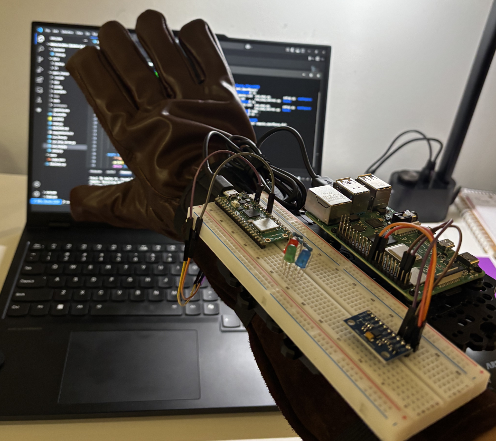
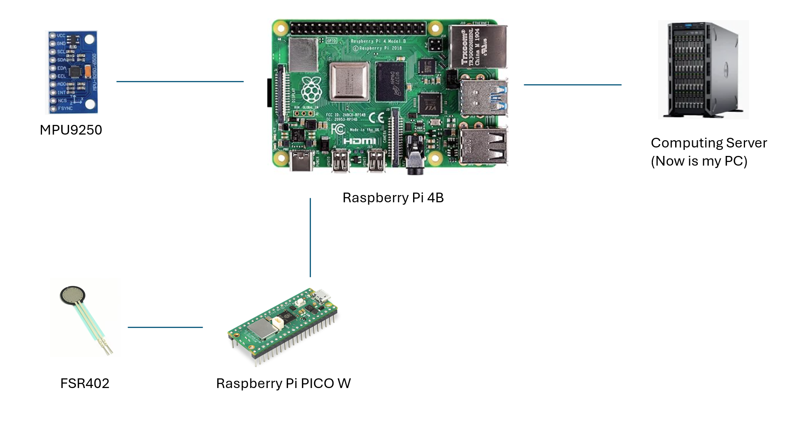
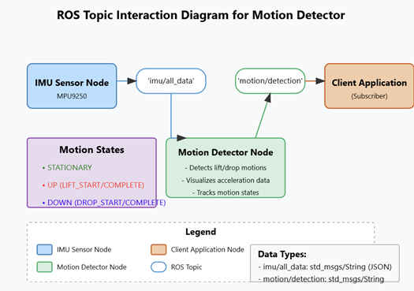
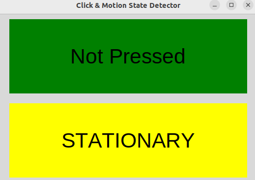
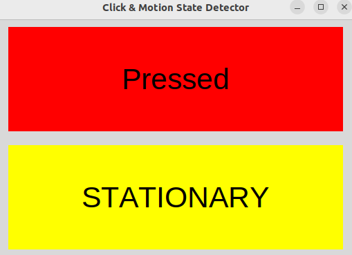
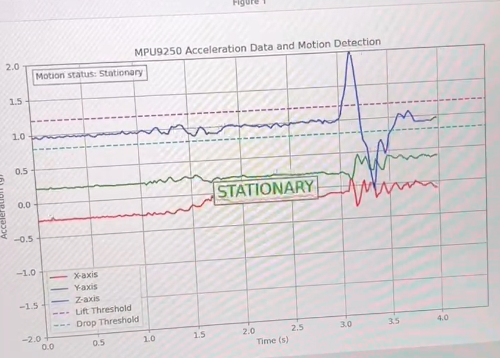
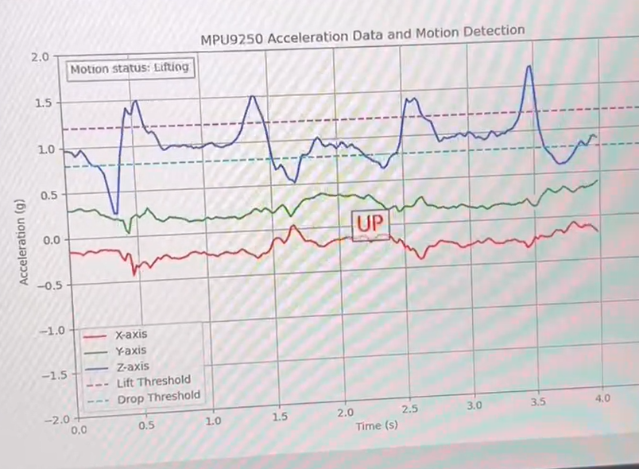
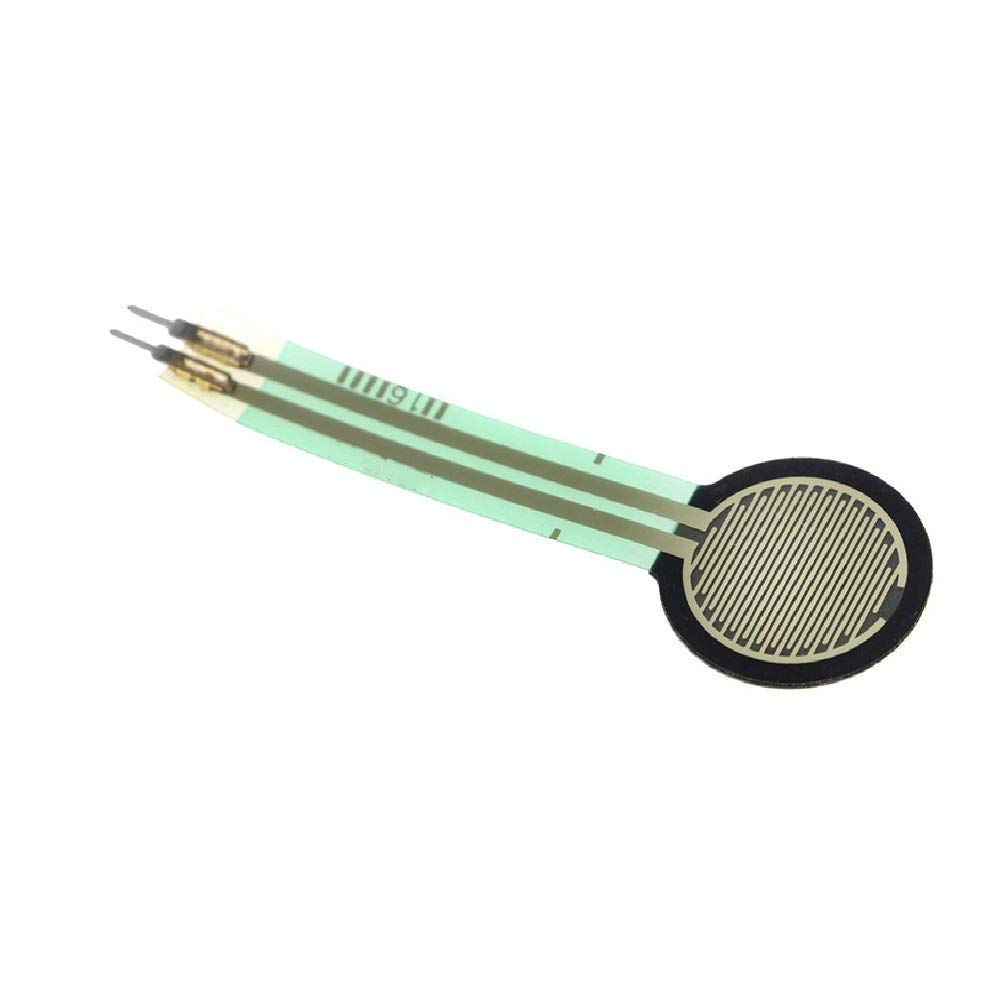

# SmartGlove

The Smart Glove module is a sub-module in out IoT Platform project. It will contain following features:
- A phisical glove implemented with Raspberry Pi 4B and several sensors.
- Gesture recognition funcion.
- Fist recognition.
- Press recognition.
- Integrated with IoT platform.




## Prototype Overview

### Framework

In the first phase, this project will complete a smart glove that can recognize gestures.

The project adopts a ROS architecture, with Ubuntu 22.04 and ROS Humble installed on both Raspberry Pi 4B and PC (virtual machine) to facilitate future expansion and implementation of complex functions.

The configuration structure is as follows:

- [Demo Video](https://youtube.com/shorts/qYl0_Sqa9_Q?si=NIhDoCjUwTQr8ySr)



The ROS framework is:



### Phisical Implementation

The physical prototype looks like this:


The code deployed on the Raspberry Pi 4B is stored separately in the following repository:

https://github.com/jeffliulab/SmartGlove_GloveSide

The wiring diagram is shown below:

- Pico W
```
(Pin 36) 3V3(OUT) ---- [ FSR402 ] ----+---- (Pin 31) GPIO26 (ADC0)
                                      |
                              [ 10kΩ Resistor ]
                                      |
                                  (Pin 38) GND
```

- Raspberry Pi 4b
```
PICO W: USB-A
Power: USB-C
MPU9250:    VCC
            GND
            SCL
            SDA

```

### GUI

When running the essential scripts, there is also a GUI window recognize the status of sensors:





## Gesture Recognition Module

### Recognize the gestures (IMU Sensor)

Using gravity detection from the MPU9250, we've implemented UP and DOWN detection:

 

### Recgnize the press (Force Sensor)

Using force sensor from FSR402:




FSR402 output analogue data, so the main.py is uploaded into PICO W:

```python
import serial

ser = serial.Serial('/dev/ttyACM0', 115200, timeout=1)
while True:
    line = ser.readline().decode('utf-8').strip()
    if line:
        print(line)
```

On Raspberry Pi 4b, use serial to read the data.