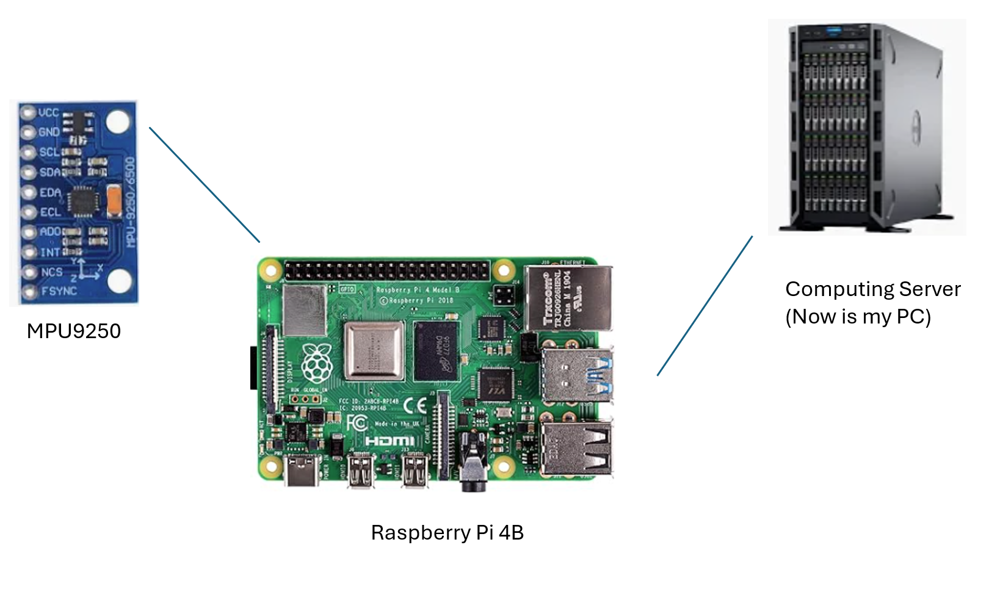

# SmartGlove

The Smart Glove module is a sub-module in out IoT Platform project. It will contain following features:
- A phisical glove implemented with Raspberry Pi 4B and several sensors.
- Gesture recognition funcion.
- Fist recognition.
- Press recognition.
- Integrated with IoT platform.

## Framework

The framework of the hardwares are:

The repo here mainly is about computing server side, glove side is responsible for collecting sensor data and publish them into ROS network and allow computing center to calculate.

The code deployed on the Raspberry Pi 4B (Glove Side) is stored separately in the following repository:

https://github.com/jeffliulab/SmartGlove_GloveSide

The communication layer is based on ROS Humble:

## V1: Gesture Recognition

Sensor: MPU9250 IMU Sensor

V1 is finished on March 12.
- Set up communication framework using ROS
- Install Ubuntu 22.04 on Raspberry Pi
- Configure internet and update pip
- Initialize MPU9250 and create publisher script
- Write callback function for real-time data
- Implement bi-gesture recognition
- Visualize data on PC via ROS

In the first phase, this project will complete a smart glove that can recognize gestures.

The project adopts a ROS architecture, with Ubuntu 22.04 and ROS Humble installed on both Raspberry Pi 4B and PC (virtual machine) to facilitate future expansion and implementation of complex functions.

The configuration structure is as follows:

- [Demo Video](https://youtube.com/shorts/qYl0_Sqa9_Q?si=NIhDoCjUwTQr8ySr)

Using gravity detection from the MPU9250, we've implemented UP and DOWN detection:

 

The physical implementation looks like this:

## V2: Press Recognition

Sensor: FSR402 Force Sensor

Deadline: April.7

TO-DO List:
- Add force sensor for "Pinch" (Press) detection
- Add switch module for channel selection
- Publish force sensor data in real-time and write call-back function

## V3: Fist Recognition

Deadline: April.28

TO-DO List:
- Add flexible sensors, finish publishing and callback functions
- Implement "make a fist" and "release hand" gestures
- (If time allows), recognize simple sign language

## Integration with IoT Platform

Deadline: April.28

TO-DO List:
- Test MQTT integration to control IoT devices

## References

See docs/papers